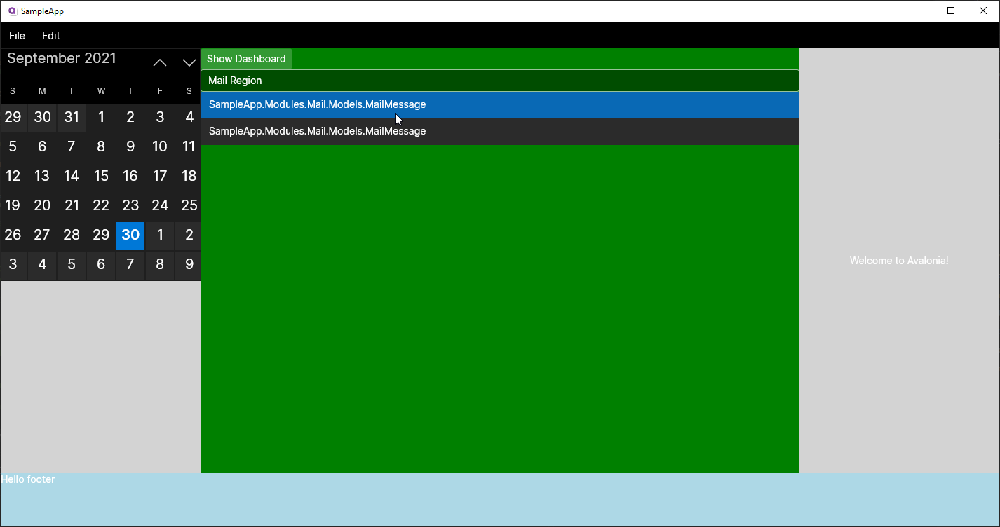

# Learn Prism.Avalonia

Get your feet wet with AvaloniaUI and [Prism.Avalonia](https://github.com/AvaloniaCommunity/Prism.Avalonia) v7.2 Modules with this sample 4-panel application.

This project uses the following technologies

* Avalonia
* [Prism.Avalonia](https://github.com/AvaloniaCommunity/Prism.Avalonia)
* .NET 5
* WSL 2 - _with X11 rendering on Windows_

## Special Thanks

First off, I'd like to give a shout out to the following for taking the time to put together the basis for this exercise.

* [PrismLibrary](https://prismlibrary.com/) - Forged from from Microsoft PnP "Patterns and practices" team.
* [AvaloniaMvvm](https://github.com/mouadcherkaoui/AvaloniaMvvm-prism)
* [Prism.Avalonia](https://github.com/AvaloniaCommunity/Prism.Avalonia)
* [Prism Outlook](https://github.com/brianlagunas/PrismOutlook)

The screenshot below shows usage of the Prism's RegionManager and Modules in action. This project is no more than a mear sandbox for feature capabilities.



### AvaloniaUI

Avalonia-ui is a library that gives WPFs like features designed to run cross platform by using platform detection and switching to use platform specific apis to be able to render the ui and its components, for example at startup the project detects if the application is running in a linux environment with a X Window System X11 "graphic protocol" at a low level and for example GTK+ or QT "graphical components libraries" at a higher level, the avalonia switch to using the X11 apis to render its components.

Lets take a look to the code for integrating avalonia in a dotnet project:

```csharp
public static AppBuilder BuildAvaloniaApp()
    => AppBuilder.Configure<App>()
        .UsePlatformDetect()
        .LogToTrace()
        .UseReactiveUI();
```

This method simply uses the app builder extension methods to configure the application, and one of the extensions method is `.UsePlatformDetect()` if we check the code of this method on github:

```csharp
public static TAppBuilder UsePlatformDetect<TAppBuilder>(this TAppBuilder builder)
    where TAppBuilder : AppBuilderBase<TAppBuilder>, new()
{
    var os = builder.RuntimePlatform.GetRuntimeInfo().OperatingSystem;

    // We don't have the ability to load every assembly right now, so we are
    // stuck with manual configuration  here
    // Helpers are extracted to separate methods to take the advantage of the fact
    // that CLR doesn't try to load dependencies before referencing method is jitted
    // Additionally, by having a hard reference to each assembly,
    // we verify that the assemblies are in the final .deps.json file
    //  so .NET Core knows where to load the assemblies from,.
    if (os == OperatingSystemType.WinNT)
    {
        LoadWin32(builder);
        LoadSkia(builder);
    }
    else if(os==OperatingSystemType.OSX)
    {
        LoadAvaloniaNative(builder);
        LoadSkia(builder);
    }
    else
    {
        LoadX11(builder);
        LoadSkia(builder);
    }
    return builder;
}
```

The code checks the current operating system and based on the result loads the specific libraries for the detected platform.

```csharp
static void LoadAvaloniaNative<TAppBuilder>(TAppBuilder builder)
    where TAppBuilder : AppBuilderBase<TAppBuilder>, new()
        => builder.UseAvaloniaNative();

static void LoadWin32<TAppBuilder>(TAppBuilder builder)
    where TAppBuilder : AppBuilderBase<TAppBuilder>, new()
        => builder.UseWin32();

static void LoadX11<TAppBuilder>(TAppBuilder builder)
    where TAppBuilder : AppBuilderBase<TAppBuilder>, new()
        => builder.UseX11();

static void LoadDirect2D1<TAppBuilder>(TAppBuilder builder)
    where TAppBuilder : AppBuilderBase<TAppBuilder>, new()
        => builder.UseDirect2D1();

static void LoadSkia<TAppBuilder>(TAppBuilder builder)
    where TAppBuilder : AppBuilderBase<TAppBuilder>, new()
        => builder.UseSkia();
```

In our previous example the builder detects that it is not running under Windows or macOS and then switch to load X11 and Skia libraries, from here the program will use the exposed apis from the Avalonia.X11.dll assembly:

```csharp
public static void InitializeX11Platform(X11PlatformOptions options = null)
{
    (new AvaloniaX11Platform()).Initialize(options ?? new X11PlatformOptions());
}

public static T UseX11<T>(this T builder)
where T : AppBuilderBase<T>, new()
{
    builder.UseWindowingSubsystem(() => (new AvaloniaX11Platform()).Initialize(AvaloniaLocator.Current.GetService<X11PlatformOptions>() ?? new X11PlatformOptions()), "");
    return builder;
}
```

The same way the avalonia framework gives us the possibility to use specific UI mechanism based on the detected platform.
